# 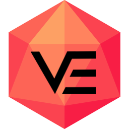 VE Foundry Client

VE Foundry Client is an independent, privately maintained Windows fork of JeidoUran's [FVTT Player Client](https://github.com/JeidoUran/fvtt-player-client). It keeps the original goal of a lightweight Foundry VTT desktop launcher and adds practical Windows-focused tools for day-to-day play.

This app is currently unsigned. Windows Defender, SmartScreen, or antivirus software may warn you when downloading or installing it. If you do not want to trust an unsigned private-use build, do not use it.

## Contents

- [Platform Support](#platform-support)
- [Download And Install](#download-and-install)
- [What VE Foundry Client Adds](#what-ve-foundry-client-adds)
- [Server Launcher](#server-launcher)
- [Favourites](#favourites)
- [Server Autorun Favourites](#server-autorun-favourites)
- [In-Game Favourites Popup](#in-game-favourites-popup)
- [Play Mode And Edit Mode](#play-mode-and-edit-mode)
- [Client Settings](#client-settings)
- [Theme Editor](#theme-editor)
- [Import, Export, And Sharing](#import-export-and-sharing)
- [Original Client Import](#original-client-import)
- [Updates](#updates)
- [Discord Rich Presence](#discord-rich-presence)
- [Acknowledgments](#acknowledgments)
- [Disclaimer](#disclaimer)

## Original player clients

| Feature                                      | [theripper93](https://github.com/theripper93/fvtt-player-client) | [omegarogue](https://github.com/OmegaRogue/fvtt-player-client) | [jeidouran](https://github.com/JeidoUran/fvtt-player-client) |
| -------------------------------------------- | :--------------------------------------------------------------: | :------------------------------------------------------------: | :-------: |
| Back to server select button in setup screen |                                ✔️                                |                               ✔️                               |    ✔️     |
| Back to server select button in login screen |                                ✔️                                |                               ✔️                               |    ✔️     |
| Back to server select button in game         |                                ❌                                |                               ✔️                               |    ✔️     |
| Foundry v13 Compatibility                    |                                ❌                                |                               ❌                               |    ✔️     |
| Discord Rich Presence                        |                                ❌                                |                               ❌                               |    ✔️     |
| Server status on game buttons                |                                ❌                                |                               ❌                               |    ✔️     |
| Theme editor                                 |                                ❌                                |                               ❌                               |    ✔️     |

## What VE Foundry Client Adds

This section only lists changes added by this fork. The guide below still explains the full app, including features inherited from the original player clients.

Discord Rich Presence, server status, the theme editor, and basic settings/theme import and export are not listed here because they already existed in JeidoUran's client.

| Added in VE Foundry Client    | What it means for you                                                                 |
| ----------------------------- | ------------------------------------------------------------------------------------- |
| Website and file favourites   | Keep campaign links, PDFs, notes, images, folders, and other tools in one launcher.   |
| Server autorun favourites     | Open selected favourites automatically when you launch a specific Foundry server.      |
| In-game favourites popup      | Press `Ctrl+Shift+F` while inside Foundry to open saved links or files.                |
| Expanded sharing controls     | Export selected settings, servers, credentials, themes, and favourites separately.      |
| Import checks for local files | Skip imported file favourites that do not exist on the current Windows computer.       |
| Original client import        | Bring across settings from older FVTT Desktop Client installs on first run.            |
| Portable Windows builds       | Use the app without a normal install, with portable app data kept beside the build.    |
| Launcher layout controls      | Reorder server and favourite tiles, then choose compact or wider column layouts.       |
| Per-server refresh control    | Stop automatic status checks for servers where polling is not wanted.                  |
| Cached server artwork         | Save Foundry login artwork for server tiles so the launcher stays more visual.         |
| Window position restore       | Reopen the launcher at the size and position you used last time.                       |

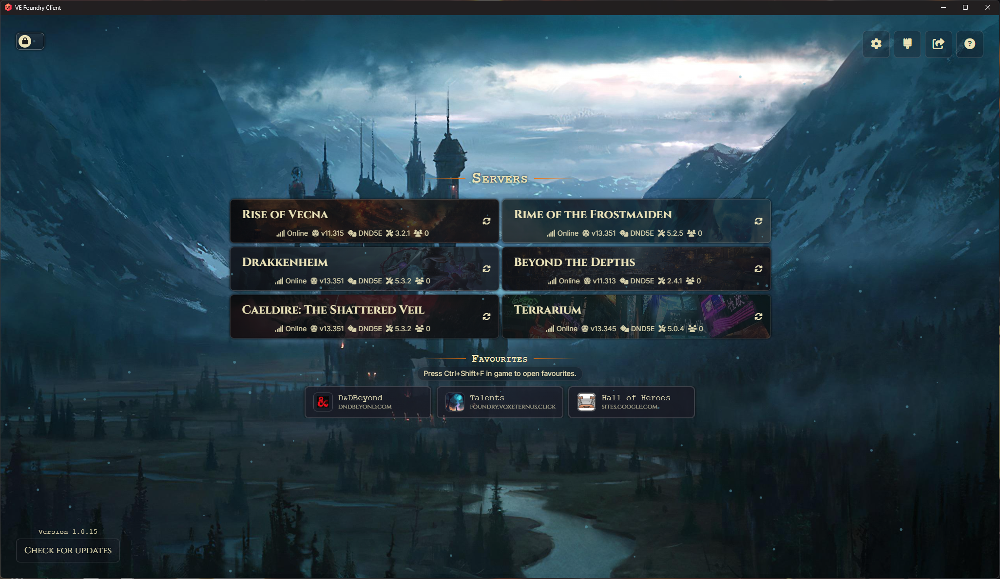

## Platform Support

VE Foundry Client is currently built and released for Windows only.

The app is unsigned. Windows may warn you the first time you download, install, or run it.

## Download And Install

GitHub releases include:

- A Windows installer (32bit and 64bit)
- A portable Windows build (64bit only)
- A zipped Windows build (64bit only)

Use the installer if you want a normal Windows app. Use the portable build if you want to keep the app and its data together in one folder for easy use from any PC/USB drive on the go.

## Server Launcher

Server tiles are the main screen of the app. Each tile represents one Foundry server and opens it in the desktop client.

Each server can store:

- Name
- URL
- Foundry username
- User password
- Admin password
- Auto-login setting
- Status refresh setting
- Autorun favourites

Server tiles can show the server status, Foundry version, world name, game system, system version, online player count, and cached login artwork.

You can turn status details on or off in client settings. You can also disable automatic status refresh for a single server, which is useful if polling a cloud-hosted server may wake it up.

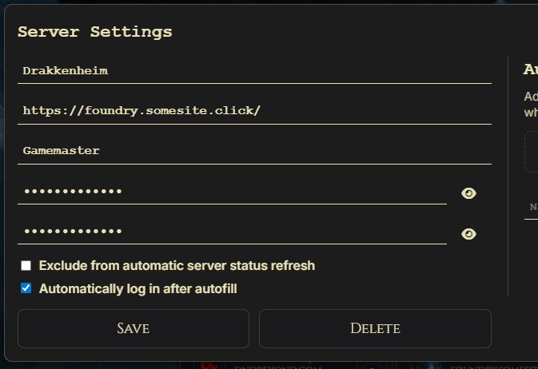

## Favourites

Favourites are quick-launch tiles for things you use while playing.

You can save:

- Websites
- Local files
- Folders
- Images
- PDFs
- Notes
- Other Windows file types

Website favourites open in your default browser. File and folder favourites open with the normal Windows app for that item.

Favourites can use custom icons, favicons, website previews, or Windows file icons. In edit mode, you can drag favourites into the order you want.

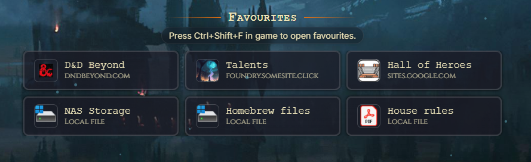

## Server Autorun Favourites

Autorun favourites open automatically when you launch a specific Foundry server.

Good uses include:

- A campaign wiki
- A shared notes document
- A rules reference
- A local PDF
- A music, map, or handout folder

Each server has its own autorun list. Autorun favourites do not need to appear in the main favourites section.

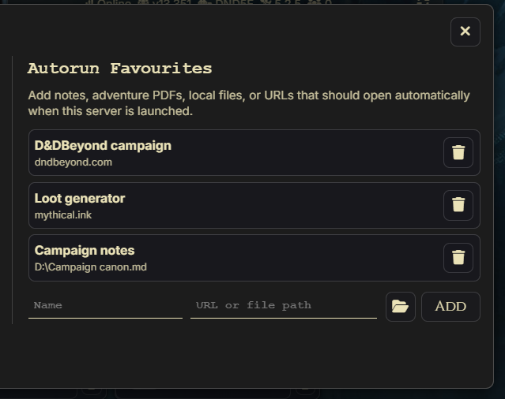

## In-Game Favourites Popup

Press `Ctrl+Shift+F` from any client window to open your favourites while you are inside Foundry.

Use this when you want a reference site, PDF, local note, or folder without returning to the launcher screen.

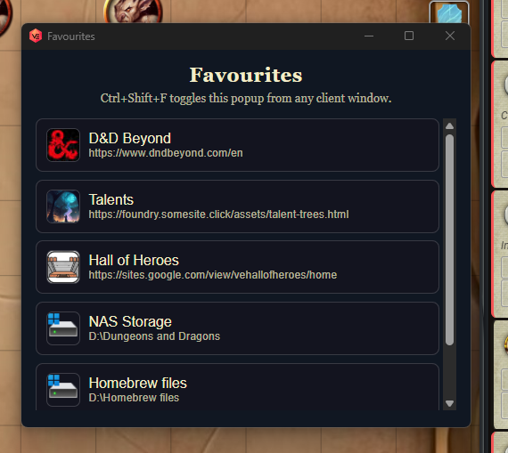

## Play Mode And Edit Mode

The launcher has two modes.

**Play mode** is for normal use. Server tiles open servers, favourites open their targets, and editing controls stay out of the way.

**Edit mode** is for setup. It shows add buttons, settings buttons, layout controls, refresh buttons, edit buttons, delete buttons, and drag reordering.

In edit mode, clicking a server or favourite does not open it. Drag the tile instead if you want to reorder it.

https://github.com/user-attachments/assets/813c4028-8b2b-4abd-a200-20dcf93a29cf

## Keyboard Shortcuts

| Shortcut                    | Action                                              |
| --------------------------- | --------------------------------------------------- |
| `Ctrl+Shift+F`              | Open or close the favourites popup.                 |
| `Ctrl+Shift+S`              | Return to the server select screen.                 |
| `Ctrl+R` or `F5`            | Reload the current page.                            |
| `Ctrl+Shift+R` or `Ctrl+F5` | Force reload the current page.                      |
| `Ctrl++` / `Ctrl+Shift++`   | Zoom in.                                            |
| `Ctrl+-`                    | Zoom out.                                           |
| `Ctrl+0`                    | Reset zoom.                                         |
| `Ctrl+Shift+I` or `F12`     | Open developer tools.                               |

## Client Settings

Client settings include:

- Cache path
- Clear cache on close
- Certificate error handling
- External links
- Notification duration
- Fullscreen behavior
- Session sharing between windows
- Server status display
- Server status refresh rate
- Discord Rich Presence

Saving client settings does not remove your servers, favourites, theme, layout choices, or saved window position.

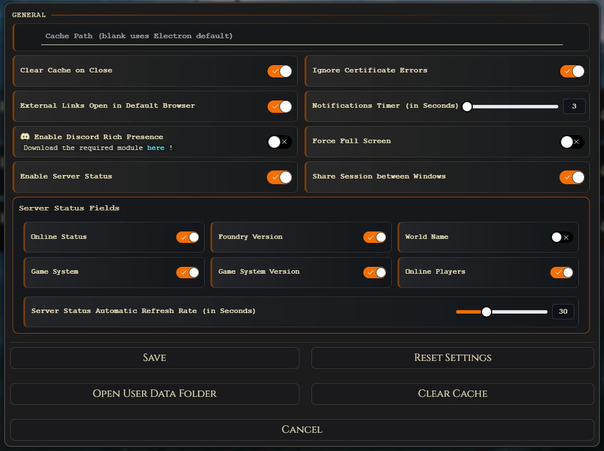

## Theme Editor

The theme editor lets you change how the launcher looks.

You can adjust:

- Base theme
- Background images
- Background colour
- Text colour
- Accent colour
- Button colours and opacity
- Particle effects
- Google Font URLs
- Local font files 

Theme imports do not include local font-file paths, because those paths only work on the computer where they were chosen.

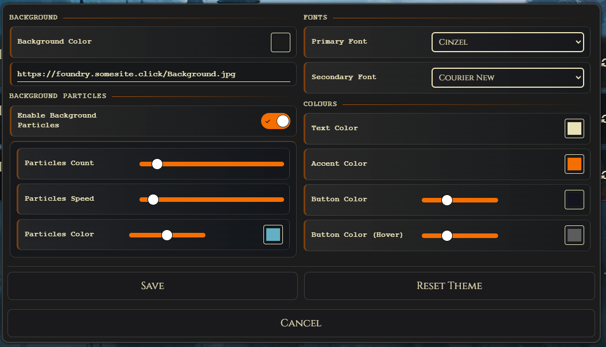

## Import, Export, And Sharing

The Share menu lets you export only the parts you want to share or back up.

Export options include:

- Client settings
- Theme
- Server addresses
- Server credentials
- Main screen favourites
- Per-server autorun favourites

Imports can be pasted as JSON text or loaded from a JSON file.

Credentials are only included if you explicitly choose to export them. Local-file favourites are checked during import and skipped if the target file does not exist on the current computer.

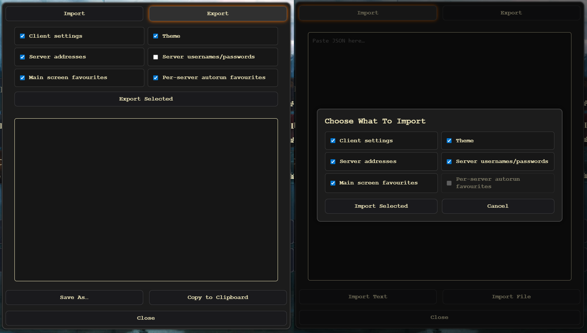

## Original Client Import

On first run, VE Foundry Client checks for settings from the original FVTT Desktop Client, including older `vtt-desktop-client` data folders.

If settings are found, the app asks whether to import them. The import can bring across servers, theme settings, and saved login details.

Before importing, the app backs up the current VE Foundry Client data file.

## Updates

The app can check GitHub releases for updates.

When an update is available:

- The update button changes state.
- The updater modal shows release notes.

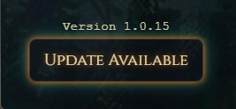  

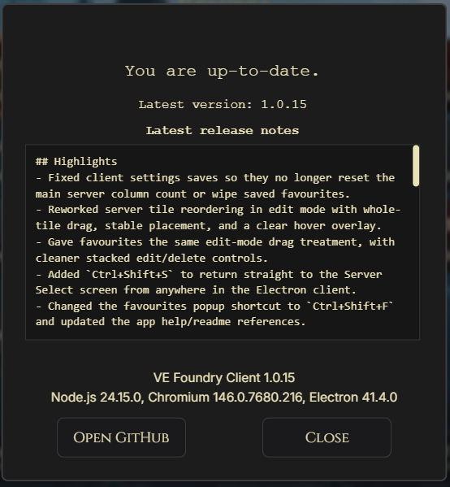

## Discord Rich Presence

Discord Rich Presence requires the [Foundry VTT Rich Presence](https://github.com/JeidoUran/fvtt-rich-presence) module to be installed and enabled in each Foundry world where you want presence updates.

Enable Rich Presence in both places:

- VE Foundry Client settings
- The Foundry module settings

## Acknowledgments

Special thanks to [theripper93](https://github.com/theripper93) and [OmegaRogue](https://github.com/OmegaRogue) for creating the original client, and to [JeidoUran](https://github.com/JeidoUran) for the fork this project was based on.

Rich Presence uses [@xhayper/discord-rpc](https://www.npmjs.com/package/@xhayper/discord-rpc).

Client and Rich Presence icons were designed by [Freepik](http://www.freepik.com/).

## Disclaimer

Development in this fork has been vibe-coded in Codex. If you spot a bug, a rough edge, or something that could be improved, please open a [GitHub Issue](https://github.com/Silvestrae/ve-foundry-client/issues) or [Pull Request](https://github.com/Silvestrae/ve-foundry-client/pulls).
