# 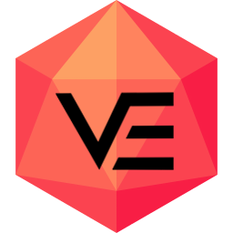 VE Foundry Client

VE Foundry Client is an independent, privately maintained fork of JeidoUran's [FVTT Player Client](https://github.com/JeidoUran/fvtt-player-client). It keeps the original goal of a lightweight Foundry VTT desktop launcher and adds practical tools for day-to-day play for my gaming group's needs.

VE Foundry Client is built and released for Windows, Linux, and macOS. Windows remains the primary day-to-day target. Linux and macOS are supported and included with full releases, with testing helped by community feedback across different
distributions and devices.

This app is currently unsigned. Windows Defender, SmartScreen, macOS Gatekeeper, Linux package managers, or antivirus software may warn you when downloading or installing it. If you do not want to trust an unsigned private-use build, do not use it.

## Contents

- [Platform Support](#platform-support)
- [Download And Install](#download-and-install)
- [What VE Foundry Client Adds](#what-ve-foundry-client-adds)
- [Server Launcher](#server-launcher)
- [Hosted Services: Sqyre And The Forge](#hosted-services-sqyre-and-the-forge)
- [Favourites](#favourites)
- [Server Autorun Favourites](#server-autorun-favourites)
- [In-Game Favourites Popup](#in-game-favourites-popup)
- [Play Mode And Edit Mode](#play-mode-and-edit-mode)
- [Keyboard Shortcuts](#keyboard-shortcuts)
- [Client Settings](#client-settings)
- [Theme Editor](#theme-editor)
- [Import, Export, And Sharing](#import-export-and-sharing)
- [Original Client Import](#original-client-import)
- [Updates](#updates)
- [Discord Rich Presence](#discord-rich-presence)
- [Acknowledgments](#acknowledgments)
- [Disclaimer](#disclaimer)

## Original player clients

| Feature                                      | [theripper93](https://github.com/theripper93/fvtt-player-client) | [omegarogue](https://github.com/OmegaRogue/fvtt-player-client) | [jeidouran](https://github.com/JeidoUran/fvtt-player-client) |
| -------------------------------------------- | :--------------------------------------------------------------: | :------------------------------------------------------------: | :----------------------------------------------------------: |
| Back to server select button in setup screen |                                ✔️                                |                               ✔️                               |                              ✔️                              |
| Back to server select button in login screen |                                ✔️                                |                               ✔️                               |                              ✔️                              |
| Back to server select button in game         |                                ❌                                |                               ✔️                               |                              ✔️                              |
| Foundry v13 Compatibility                    |                                ❌                                |                               ❌                               |                              ✔️                              |
| Discord Rich Presence                        |                                ❌                                |                               ❌                               |                              ✔️                              |
| Server status on game buttons                |                                ❌                                |                               ❌                               |                              ✔️                              |
| Theme editor                                 |                                ❌                                |                               ❌                               |                              ✔️                              |

## What VE Foundry Client Adds

This section only lists changes added by this fork. The guide below still explains the full app, including features inherited from the original player clients.

Discord Rich Presence, server status, the theme editor, and basic settings/theme import and export are not listed here because they already existed in JeidoUran's client.

| Added in VE Foundry Client    | What it means for you                                                                 |
| ----------------------------- | ------------------------------------------------------------------------------------- |
| Website and file favourites   | Keep campaign links, PDFs, notes, images, folders, and other tools in one launcher.   |
| Server autorun favourites     | Open selected favourites automatically when you launch a specific Foundry server.     |
| In-game favourites popup      | Press `Ctrl+Shift+F` while inside Foundry to open saved links or files.               |
| Expanded sharing controls     | Export selected settings, servers, credentials, themes, and favourites separately.    |
| Import checks for local files | Skip imported file favourites that do not exist on the current computer.              |
| Original client import        | Bring across settings from older FVTT Desktop Client installs on first run.           |
| Portable Windows builds       | Use the app without a normal install, with portable app data kept beside the build.   |
| Launcher layout controls      | Reorder server and favourite tiles, then choose compact or wider column layouts.      |
| Per-server refresh control    | Stop automatic status checks for servers where polling is not wanted.                 |
| Cached server artwork         | Save Foundry login artwork for server tiles so the launcher stays more visual.        |
| Active server effect          | Highlight the server you launched so it is easy to see which world is currently open. |
| Window position restore       | Reopen the launcher at the size and position you used last time.                      |
| Sqyre and Forge support       | Keep separate host accounts and sessions for each hosted server tile.                 |

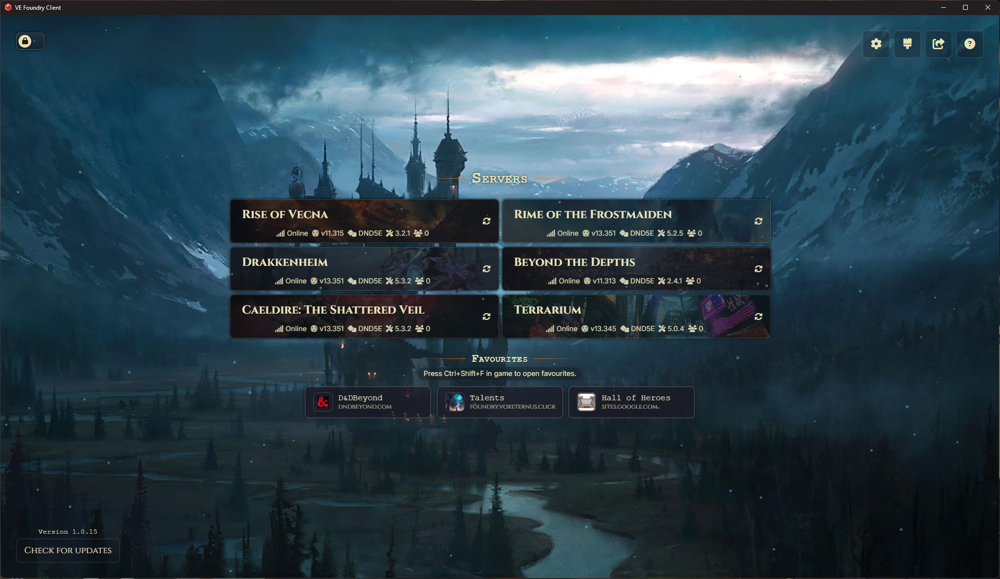

## Platform Support

VE Foundry Client is built and released for Windows, Linux, and macOS.

Windows remains the primary daily-use target. Linux and macOS are supported through release builds and rely on community testing across distributions, desktop environments, package formats, and Apple hardware. Packaging coverage is limited to the
artifacts listed below.

The app is unsigned. Windows may warn you the first time you download, install, or run it. Linux package managers or desktop environments may warn about unsigned packages. macOS may require you to explicitly allow the app in Privacy & Security before it will open.

## Download And Install

GitHub releases include:

- A Windows installer (64bit only)
- A portable Windows build (64bit only)
- A zipped Windows build (64bit only)
- Linux AppImage builds (64bit and arm64)
- Linux `.deb` builds (64bit and arm64)
- Linux `.rpm` builds (64bit and arm64)
- Linux zipped and `.tar.gz` builds (64bit and arm64)
- macOS `.dmg` builds (Intel and Apple Silicon)
- macOS zipped builds (Intel and Apple Silicon)

Use the installer if you want a normal Windows app. Use the portable build if you want to keep the app and its data together in one folder for easy use from any PC/USB drive on the go.

On Linux, start with the AppImage unless you specifically want a package for a Debian/Ubuntu-style or RPM-based system.

On macOS, use the Apple Silicon build on M-series Macs and the Intel build on older Intel Macs. These builds are unsigned, so Gatekeeper may require a manual allow step.

## Server Launcher

Server tiles are the main screen of the app. Each tile represents one Foundry server and opens it in the desktop client.

Each server can store:

- Name
- URL
- Foundry username
- User password
- Admin password
- Auto-login setting
- Status refresh setting
- Autorun favourites

Server tiles can show the server status, Foundry version, world name, game system, system version, online player count, and cached login artwork.

Whenever a server has users logged in, its tile shows a nice visual effect so you can quickly see which servers are active.

https://github.com/user-attachments/assets/cb4333c2-7067-4865-9391-0bebaaaffea9

You can turn status details on or off in client settings. You can also disable automatic status refresh for a single server, which is useful if polling a cloud-hosted server may wake it up.

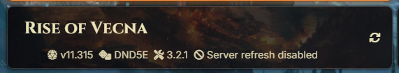

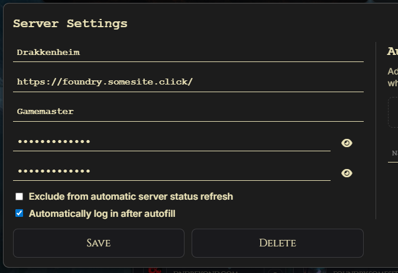

## Hosted Services: Sqyre And The Forge

VE Foundry Client supports games hosted by [Sqyre](https://www.sqyre.app/) and [The Forge](https://forge-vtt.com/). Add the player-facing address you normally use to open the game:

- Sqyre accepts either its game dashboard address or the game's direct `*.sqyre.app/game` address.
- The Forge accepts the game's `*.forge-vtt.com` address.

When a private game requires host authentication, sign in on the host page shown inside VE Foundry Client. A hosted server tile can optionally save its host username or email and password in Server Settings. These credentials are encrypted using the operating system's credential protection, stored separately from normal settings exports, and filled into the host's login form without submitting it automatically. The regular username and password fields remain for Foundry's own login screen.

Each hosted tile uses its own persistent browser session. Cookies, host credentials, status requests, and signed-in account details are isolated by tile, so different Sqyre or Forge tiles can use different accounts without overwriting one another. Clearing the saved host login, or deleting the tile, clears that tile's hosted profile.

Google may reject sign-in from an embedded desktop browser. If that happens, use the host's email and password option. VE Foundry Client displays an explanation instead of leaving the client on Google's error page.

Hosted tiles use a cloud badge to identify the provider and, while authenticated, show the signed-in account name. They also display the metadata each provider makes available, such as lifecycle status, Foundry version, game system, world or game details, and player information. A Sqyre or Forge logo is used when the game has no image and the tile has no custom background.

Sqyre may briefly use a separate launch page before Foundry is ready. VE Foundry Client handles it in the tile's isolated game window and shows a themed progress banner. The original launcher is restored when you return to Server Select. The Forge follows the same isolated-window model while retaining its normal authentication and launch flow.

Hosted status messages include:

- `Online`, `Starting`, `Stopping`, `Sleeping`, or another provider lifecycle state when available
- `Sign In Required` when the host session is not authenticated
- `Unavailable` when the saved game address no longer exists

If you delete and recreate a hosted game, the provider may assign it a new address. Edit the server tile to use that new address; VE Foundry Client will not silently associate an old tile with a different game.

## Favourites

Favourites are quick-launch tiles for things you use while playing.

You can save:

- Websites
- Local files
- Folders
- Images
- PDFs
- Notes
- Other Windows file types

Website favourites open in your default browser. File and folder favourites open with the normal Windows app for that item.

Favourites can use custom icons, favicons, website previews, or Windows file icons. In edit mode, you can drag favourites into the order you want.

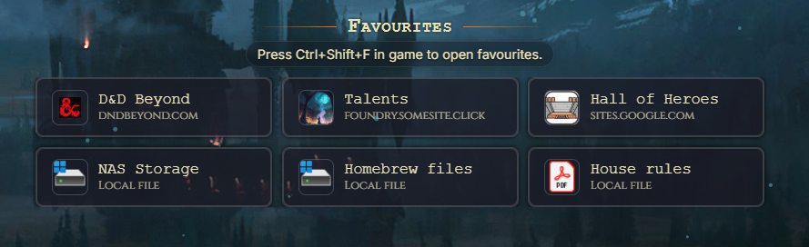

## Server Autorun Favourites

Autorun favourites open automatically when you launch a specific Foundry server.

Good uses include:

- A campaign wiki
- A shared notes document
- A rules reference
- A local PDF
- A music, map, or handout folder

Each server has its own autorun list. Autorun favourites do not need to appear in the main favourites section.

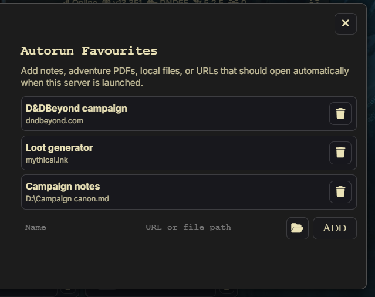

## In-Game Favourites Popup

Press `Ctrl+Shift+F` from any client window to open your favourites while you are inside Foundry.

Use this when you want a reference site, PDF, local note, or folder without returning to the launcher screen.

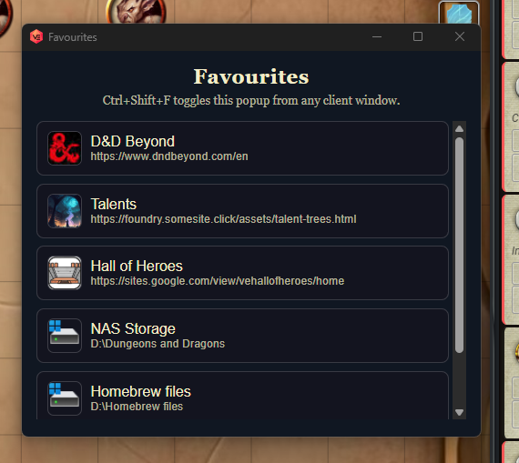

## Play Mode And Edit Mode

The launcher has two modes.

**Play mode** is for normal use. Server tiles open servers, favourites open their targets, and editing controls stay out of the way.

**Edit mode** is for setup. It shows add buttons, settings buttons, layout controls, refresh buttons, edit buttons, delete buttons, and drag reordering.

In edit mode, clicking a server or favourite does not open it. Drag the tile instead if you want to reorder it.

https://github.com/user-attachments/assets/813c4028-8b2b-4abd-a200-20dcf93a29cf

## Keyboard Shortcuts

| Shortcut                    | Action                              |
| --------------------------- | ----------------------------------- |
| `Ctrl+Shift+F`              | Open or close the favourites popup. |
| `Ctrl+Shift+S`              | Return to the server select screen. |
| `Ctrl+R` or `F5`            | Reload the current page.            |
| `Ctrl+Shift+R` or `Ctrl+F5` | Force reload the current page.      |
| `Ctrl++` / `Ctrl+Shift++`   | Zoom in.                            |
| `Ctrl+-`                    | Zoom out.                           |
| `Ctrl+0`                    | Reset zoom.                         |
| `Ctrl+Shift+I` or `F12`     | Open developer tools.               |

## Client Settings

Client settings include:

- Cache path
- Clear cache on close
- Certificate error handling
- External links
- Notification duration
- Fullscreen behavior
- Session sharing between windows
- Linux XWayland compatibility mode (requires an app restart)
- Server status display
- Server status refresh rate
- Discord Rich Presence

Saving client settings does not remove your servers, favourites, theme, layout choices, or saved window position.

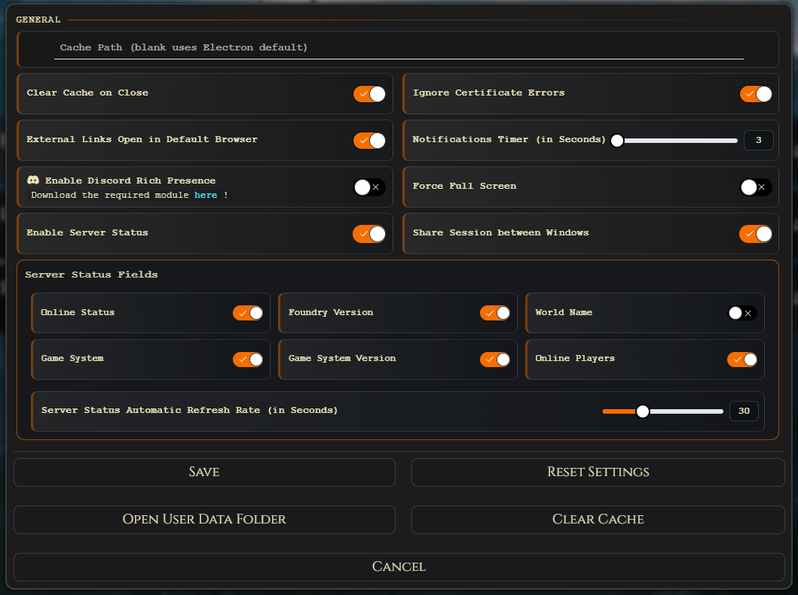

## Theme Editor

The theme editor lets you change how the launcher looks.

You can adjust:

- Base theme
- Background images
- Background colour
- Text colour
- Accent colour
- Button colours and opacity
- Particle effects
- Google Font URLs
- Local font files

Theme imports do not include local font-file paths, because those paths only work on the computer where they were chosen.

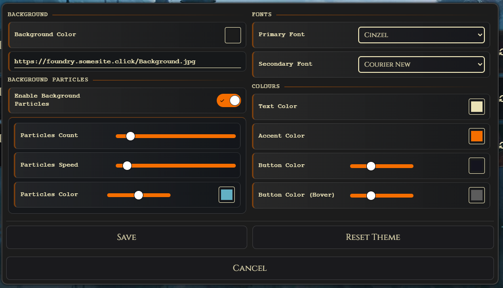

## Import, Export, And Sharing

The Share menu lets you export only the parts you want to share or back up.

Export options include:

- Client settings
- Theme
- Server addresses
- Server credentials
- Main screen favourites
- Per-server autorun favourites

Imports can be pasted as JSON text or loaded from a JSON file.

Foundry server credentials are only included if you explicitly choose to export them. Hosted-service credentials are deliberately excluded from exports. Local-file favourites are checked during import and skipped if the target file does not exist on the current computer.

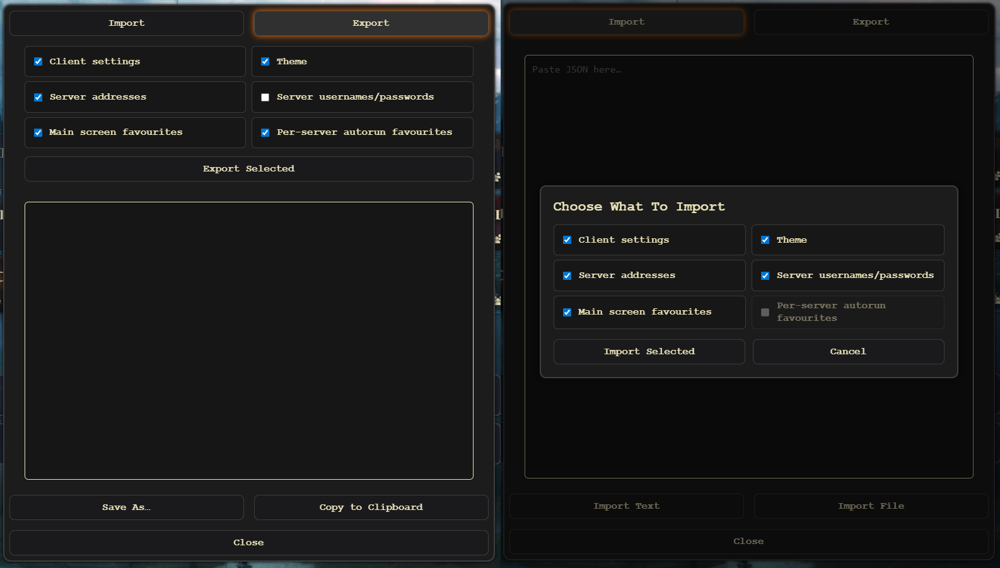

## Original Client Import

On first run, VE Foundry Client checks for settings from the original FVTT Desktop Client, including older `vtt-desktop-client` data folders.

If settings are found, the app asks whether to import them. The import can bring across servers, theme settings, and saved login details.

Before importing, the app backs up the current VE Foundry Client data file.

## Updates

The app can check GitHub releases for updates.

When an update is available:

- The update button changes state.
- The updater modal shows release notes.

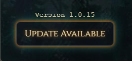

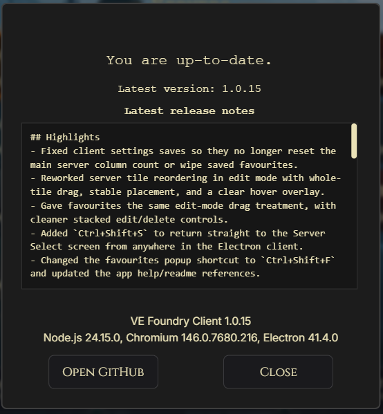

## Discord Rich Presence

Discord Rich Presence requires the [Foundry VTT Rich Presence](https://github.com/JeidoUran/fvtt-rich-presence) module to be installed and enabled in each Foundry world where you want presence updates.

Enable Rich Presence in both places:

- VE Foundry Client settings
- The Foundry module settings

## Acknowledgments

Special thanks to [theripper93](https://github.com/theripper93) and [OmegaRogue](https://github.com/OmegaRogue) for creating the original client, and to [JeidoUran](https://github.com/JeidoUran) for the fork this project was based on.

Rich Presence uses [@xhayper/discord-rpc](https://www.npmjs.com/package/@xhayper/discord-rpc).

Client and Rich Presence icons were designed by [Freepik](http://www.freepik.com/).

## Disclaimer

Development in this fork has been vibe-coded in Codex. If you spot a bug, a rough edge, or something that could be improved, please open a [GitHub Issue](https://github.com/Silvestrae/ve-foundry-client/issues) or [Pull Request](https://github.com/Silvestrae/ve-foundry-client/pulls).
